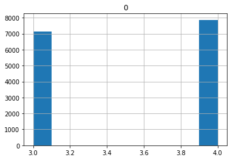

## Pet Adoption Speed Prediction

## Introduction

For this project I chose a Kaggle dataset for an ongoing competition that can be found at https://www.kaggle.com/c/petfinder-adoption-prediction. This competition involves predicting the speed of adoption for a pet adoption site in Malaysia. Provided are various data fields such as the color of the pet, the age, and the breed. 

Also provided are image data on uploaded photos of the pets that was ran through Google's Vision API and sentiment data that was ran through Google's Natural Language API, on the description given for the pets. 


## Import libraries


```python
import pandas as pd
import numpy as np
import matplotlib.pyplot as plt
%matplotlib inline
import seaborn as sns
from sklearn.preprocessing import StandardScaler
from sklearn.model_selection import train_test_split
from sklearn.linear_model import LogisticRegression
from sklearn.pipeline import Pipeline
from sklearn.decomposition import PCA
from sklearn.ensemble import RandomForestClassifier
from imblearn.over_sampling import SMOTE, ADASYN
from sklearn.model_selection import GridSearchCV
import xgboost as xgb
import os
import json
from sklearn.metrics import cohen_kappa_score
from sklearn.metrics import accuracy_score
from sklearn.model_selection import cross_val_score
from sklearn.metrics import confusion_matrix
from sklearn.metrics import make_scorer
```

## Grab train and test set

The test set provided does not include the 'AdoptionSpeed' target variable and is only used to make predictions to submit to Kaggle for scoring.


```python
train = pd.read_csv('train/train.csv')
test = pd.read_csv('test/test.csv')
```

## Fill missing values

The 'Name' and 'Description' columns are the only two columns will missing data for both the train and test set. Since both fields are text, they will be filled with a blank space, ' '.


```python
train.isna().sum()
```


    Type                0
    Name             1257
    Age                 0
    Breed1              0
    Breed2              0
    Gender              0
    Color1              0
    Color2              0
    Color3              0
    MaturitySize        0
    FurLength           0
    Vaccinated          0
    Dewormed            0
    Sterilized          0
    Health              0
    Quantity            0
    Fee                 0
    State               0
    RescuerID           0
    VideoAmt            0
    Description        12
    PetID               0
    PhotoAmt            0
    AdoptionSpeed       0
    dtype: int64


```python
test.isna().sum()
```


    Type              0
    Name            303
    Age               0
    Breed1            0
    Breed2            0
    Gender            0
    Color1            0
    Color2            0
    Color3            0
    MaturitySize      0
    FurLength         0
    Vaccinated        0
    Dewormed          0
    Sterilized        0
    Health            0
    Quantity          0
    Fee               0
    State             0
    RescuerID         0
    VideoAmt          0
    Description       2
    PetID             0
    PhotoAmt          0
    dtype: int64


```python
train.Name.fillna(' ', inplace=True)
train.Description.fillna(' ', inplace=True)

test.Name.fillna(' ', inplace=True)
test.Description.fillna(' ', inplace=True)
```

## Explore variables

### Histograms


```python
train.hist(figsize=(20,20))
```


    array([[<matplotlib.axes._subplots.AxesSubplot object at 0x0000022794D508D0>,
            <matplotlib.axes._subplots.AxesSubplot object at 0x0000022792C089B0>,
            <matplotlib.axes._subplots.AxesSubplot object at 0x0000022795235128>,
            <matplotlib.axes._subplots.AxesSubplot object at 0x000002279363C278>],
           [<matplotlib.axes._subplots.AxesSubplot object at 0x0000022799173390>,
            <matplotlib.axes._subplots.AxesSubplot object at 0x0000022799173748>,
            <matplotlib.axes._subplots.AxesSubplot object at 0x00000227991DAB38>,
            <matplotlib.axes._subplots.AxesSubplot object at 0x00000227938B14E0>],
           [<matplotlib.axes._subplots.AxesSubplot object at 0x00000227D6777DD8>,
            <matplotlib.axes._subplots.AxesSubplot object at 0x00000227D64E5128>,
            <matplotlib.axes._subplots.AxesSubplot object at 0x00000227D6505438>,
            <matplotlib.axes._subplots.AxesSubplot object at 0x00000227D63A5780>],
           [<matplotlib.axes._subplots.AxesSubplot object at 0x00000227D63C7A58>,
            <matplotlib.axes._subplots.AxesSubplot object at 0x00000227D63C1D68>,
            <matplotlib.axes._subplots.AxesSubplot object at 0x00000227D63B30B8>,
            <matplotlib.axes._subplots.AxesSubplot object at 0x00000227D656D3C8>],
           [<matplotlib.axes._subplots.AxesSubplot object at 0x00000227D659C6D8>,
            <matplotlib.axes._subplots.AxesSubplot object at 0x00000227D65909E8>,
            <matplotlib.axes._subplots.AxesSubplot object at 0x00000227D6469CF8>,
            <matplotlib.axes._subplots.AxesSubplot object at 0x00000227D6470048>]],
          dtype=object)


<b>Most of the variables do not have a normal distribution which means we will probably want to standardize them later on. The target variable 'AdoptionSpeed' has a low count of '0' values which could negatively impact training a classifier on the training set.

We can also see that most pets have only one breed and one color as there are many zero values for 'Breed2', 'Color2', and 'Color3'.

<b>Now we can look at some of the value counts of various columns just to get a feel of the distribution of the pets.

## Are dogs or cats more common?


```python
train['Type'].value_counts().rename({1:'Dog',
                                        2:'Cat'}).plot(kind='barh',
                                                       figsize=(15,6))
plt.yticks(fontsize='xx-large')
plt.title('Type Distribution', fontsize='xx-large')
```


    Text(0.5, 1.0, 'Type Distribution')


<b>Slightly more dogs than cats.

## Do dogs and cats have different adoption rates on average?


```python
train['AdoptionSpeed'][train['Type'] == 1].value_counts().sort_index().plot(kind='barh',
                                                       figsize=(15,6))
plt.yticks(fontsize='xx-large')
plt.ylabel('Adoption Speed')
plt.title('Adoption Speed Distribution (Dogs)', fontsize='xx-large')
```


    Text(0.5, 1.0, 'Adoption Speed Distribution (Dogs)')


```python
train['AdoptionSpeed'][train['Type'] == 2].value_counts().sort_index().plot(kind='barh',
                                                       figsize=(15,6))
plt.yticks(fontsize='xx-large')
plt.ylabel('Adoption Speed')
plt.title('Adoption Speed Distribution (Cats)', fontsize='xx-large')
```


    Text(0.5, 1.0, 'Adoption Speed Distribution (Cats)')


```python
pd.DataFrame([train['AdoptionSpeed'][train['Type'] == 1].mean(),train['AdoptionSpeed'][train['Type'] == 2].mean()]).rename({0:'Dogs',
                                        1:'Cats'}).plot(kind='barh',
                                                       figsize=(15,6), legend=None)
plt.yticks(fontsize='xx-large')
plt.xlabel('Adoption Speed')
plt.title('Average Adoption Speed', fontsize='xx-large')
```


    Text(0.5, 1.0, 'Average Adoption Speed')


<b> The largest number of dogs aren't adopted after 100 days of being listed whereas the largest number of cats are adopted in the first month of being listed. Dogs on average take a longer amount of time to be adopted than cats.

## What breeds are most common?


```python
train['Breed1'].value_counts().head(10).plot(kind='barh',
                                                       figsize=(15,6))
plt.yticks(fontsize='xx-large')
plt.ylabel('Breed ID')
plt.title('Breed Distribution (Breed1)', fontsize='xx-large')
```


    Text(0.5, 1.0, 'Breed Distribution (Breed1)')


<b> Breed 307 which signifies an unknown breed is the most common primary breed followed by Breed 266 which are domestic shorthair cats.


```python
train['Breed2'].value_counts().head(10).plot(kind='barh',
                                                       figsize=(15,6))
plt.yticks(fontsize='xx-large')
plt.ylabel('Breed ID')
plt.title('Breed Distribution(Breed2)', fontsize='xx-large')
```


    Text(0.5, 1.0, 'Breed Distribution(Breed2)')


<b> Most pets do not have a second breed but the largest number of the ones that do have an unknown second breed.

## More male or female pets?


```python
train['Gender'][(train['Gender'] == 1) | (train['Gender'] == 2)].value_counts().rename({1:'Male',
                                        2:'Female'}).plot(kind='barh',
                                                       figsize=(15,6))
plt.yticks(fontsize='xx-large')
plt.title('Gender Distribution (excluding groups of pets)', fontsize='xx-large')
```


    Text(0.5, 1.0, 'Gender Distribution (excluding groups of pets)')


<b> More pets are female.

## How many photos are usually provided?


```python
train['PhotoAmt'].value_counts().sort_index().plot(kind='barh',
                                                       figsize=(20,15))
plt.yticks(fontsize='xx-large')
plt.ylabel('Number of Photos')
plt.title('Amount of Photos Distribution', fontsize='xx-large')
```


    Text(0.5, 1.0, 'Amount of Photos Distribution')


<b>Most listings that have photos only have 1-5 of them.

## Add image metadata

<b>The image metadata is given by a collection of JSON files with the 'PetID' of the corresponding pet in the name of the file. Some pets have multiple pictures but I will initially just use the first three photos of each pet if available as these are likely the main photos seen by people searching for pets to adopt and thus have the largest effect on drawing in a perspective adoption.
  


```python
for index, row in train.iterrows():  ## First photo
    file = 'train_metadata/' + row['PetID'] + '-1.json'
    if os.path.exists(file):
        data = json.load(open(file, encoding="utf8"))
        vertex_x = data['cropHintsAnnotation']['cropHints'][0]['boundingPoly']['vertices'][2]['x']
        vertex_y = data['cropHintsAnnotation']['cropHints'][0]['boundingPoly']['vertices'][2]['y']
        bounding_confidence = data['cropHintsAnnotation']['cropHints'][0]['confidence']
        bounding_importance_frac = data['cropHintsAnnotation']['cropHints'][0].get('importanceFraction', -1)
        dominant_blue = data['imagePropertiesAnnotation']['dominantColors']['colors'][0]['color']['blue']
        dominant_green = data['imagePropertiesAnnotation']['dominantColors']['colors'][0]['color']['green']
        dominant_red = data['imagePropertiesAnnotation']['dominantColors']['colors'][0]['color']['red']
        dominant_pixel_frac = data['imagePropertiesAnnotation']['dominantColors']['colors'][0]['pixelFraction']
        dominant_score = data['imagePropertiesAnnotation']['dominantColors']['colors'][0]['score']
        train.loc[index, 'vertex_x']= vertex_x
        train.loc[index, 'vertex_y']= vertex_y
        train.loc[index, 'bounding_conf']= bounding_confidence
        train.loc[index, 'bounding_imp']= bounding_importance_frac
        train.loc[index, 'dom_blue']= dominant_blue
        train.loc[index, 'dom_green']= dominant_green
        train.loc[index, 'dom_red']= dominant_red
        train.loc[index, 'pixel_frac']= dominant_pixel_frac
        train.loc[index, 'score']= dominant_score
    else:
        train.loc[index, 'vertex_x']= -1
        train.loc[index, 'vertex_y']= -1
        train.loc[index, 'bounding_conf']= -1
        train.loc[index, 'bounding_imp']= -1
        train.loc[index, 'dom_blue']= -1
        train.loc[index, 'dom_green']= -1
        train.loc[index, 'dom_red']= -1
        train.loc[index, 'pixel_frac']= -1
        train.loc[index, 'score']= -1
```


```python
for index, row in train.iterrows():  ## Second photo
    file = 'train_metadata/' + row['PetID'] + '-2.json'
    if os.path.exists(file):
        data = json.load(open(file, encoding="utf8"))
        vertex_x = data['cropHintsAnnotation']['cropHints'][0]['boundingPoly']['vertices'][2]['x']
        vertex_y = data['cropHintsAnnotation']['cropHints'][0]['boundingPoly']['vertices'][2]['y']
        bounding_confidence = data['cropHintsAnnotation']['cropHints'][0]['confidence']
        bounding_importance_frac = data['cropHintsAnnotation']['cropHints'][0].get('importanceFraction', -1)
        try:
            dominant_blue = data['imagePropertiesAnnotation']['dominantColors']['colors'][0]['color']['blue']
        except:
            dominant_blue = -1
        try:
            dominant_green = data['imagePropertiesAnnotation']['dominantColors']['colors'][0]['color']['green']
        except: 
            dominant_green = -1
        try: 
            dominant_red = data['imagePropertiesAnnotation']['dominantColors']['colors'][0]['color']['red']
        except:
            dominant_red = -1
        dominant_pixel_frac = data['imagePropertiesAnnotation']['dominantColors']['colors'][0]['pixelFraction']
        dominant_score = data['imagePropertiesAnnotation']['dominantColors']['colors'][0]['score']
        train.loc[index, 'vertex_x2']= vertex_x
        train.loc[index, 'vertex_y2']= vertex_y
        train.loc[index, 'bounding_conf2']= bounding_confidence
        train.loc[index, 'bounding_imp2']= bounding_importance_frac
        train.loc[index, 'dom_blue2']= dominant_blue
        train.loc[index, 'dom_green2']= dominant_green
        train.loc[index, 'dom_red2']= dominant_red
        train.loc[index, 'pixel_frac2']= dominant_pixel_frac
        train.loc[index, 'score2']= dominant_score
    else:
        train.loc[index, 'vertex_x2']= -1
        train.loc[index, 'vertex_y2']= -1
        train.loc[index, 'bounding_conf2']= -1
        train.loc[index, 'bounding_imp2']= -1
        train.loc[index, 'dom_blue2']= -1
        train.loc[index, 'dom_green2']= -1
        train.loc[index, 'dom_red2']= -1
        train.loc[index, 'pixel_frac2']= -1
        train.loc[index, 'score2']= -1
```


```python
for index, row in train.iterrows():  ## Third photo
    file = 'train_metadata/' + row['PetID'] + '-3.json'
    if os.path.exists(file):
        data = json.load(open(file, encoding="utf8"))
        vertex_x = data['cropHintsAnnotation']['cropHints'][0]['boundingPoly']['vertices'][2]['x']
        vertex_y = data['cropHintsAnnotation']['cropHints'][0]['boundingPoly']['vertices'][2]['y']
        bounding_confidence = data['cropHintsAnnotation']['cropHints'][0]['confidence']
        bounding_importance_frac = data['cropHintsAnnotation']['cropHints'][0].get('importanceFraction', -1)
        try:
            dominant_blue = data['imagePropertiesAnnotation']['dominantColors']['colors'][0]['color']['blue']
        except:
            dominant_blue = -1
        try:
            dominant_green = data['imagePropertiesAnnotation']['dominantColors']['colors'][0]['color']['green']
        except: 
            dominant_green = -1
        try: 
            dominant_red = data['imagePropertiesAnnotation']['dominantColors']['colors'][0]['color']['red']
        except:
            dominant_red = -1
        dominant_pixel_frac = data['imagePropertiesAnnotation']['dominantColors']['colors'][0]['pixelFraction']
        dominant_score = data['imagePropertiesAnnotation']['dominantColors']['colors'][0]['score']
        train.loc[index, 'vertex_x3']= vertex_x
        train.loc[index, 'vertex_y3']= vertex_y
        train.loc[index, 'bounding_conf3']= bounding_confidence
        train.loc[index, 'bounding_imp3']= bounding_importance_frac
        train.loc[index, 'dom_blue3']= dominant_blue
        train.loc[index, 'dom_green3']= dominant_green
        train.loc[index, 'dom_red3']= dominant_red
        train.loc[index, 'pixel_frac3']= dominant_pixel_frac
        train.loc[index, 'score3']= dominant_score
    else:
        train.loc[index, 'vertex_x3']= -1
        train.loc[index, 'vertex_y3']= -1
        train.loc[index, 'bounding_conf3']= -1
        train.loc[index, 'bounding_imp3']= -1
        train.loc[index, 'dom_blue3']= -1
        train.loc[index, 'dom_green3']= -1
        train.loc[index, 'dom_red3']= -1
        train.loc[index, 'pixel_frac3']= -1
        train.loc[index, 'score3']= -1
```


```python
for index, row in test.iterrows():  # First photo
    file = 'test_metadata/' + row['PetID'] + '-1.json'
    if os.path.exists(file):
        data = json.load(open(file, encoding="utf8"))
        vertex_x = data['cropHintsAnnotation']['cropHints'][0]['boundingPoly']['vertices'][2]['x']
        vertex_y = data['cropHintsAnnotation']['cropHints'][0]['boundingPoly']['vertices'][2]['y']
        bounding_confidence = data['cropHintsAnnotation']['cropHints'][0]['confidence']
        bounding_importance_frac = data['cropHintsAnnotation']['cropHints'][0].get('importanceFraction', -1)
        dominant_blue = data['imagePropertiesAnnotation']['dominantColors']['colors'][0]['color']['blue']
        dominant_green = data['imagePropertiesAnnotation']['dominantColors']['colors'][0]['color']['green']
        dominant_red = data['imagePropertiesAnnotation']['dominantColors']['colors'][0]['color']['red']
        dominant_pixel_frac = data['imagePropertiesAnnotation']['dominantColors']['colors'][0]['pixelFraction']
        dominant_score = data['imagePropertiesAnnotation']['dominantColors']['colors'][0]['score']
        test.loc[index, 'vertex_x']= vertex_x
        test.loc[index, 'vertex_y']= vertex_y
        test.loc[index, 'bounding_conf']= bounding_confidence
        test.loc[index, 'bounding_imp']= bounding_importance_frac
        test.loc[index, 'dom_blue']= dominant_blue
        test.loc[index, 'dom_green']= dominant_green
        test.loc[index, 'dom_red']= dominant_red
        test.loc[index, 'pixel_frac']= dominant_pixel_frac
        test.loc[index, 'score']= dominant_score
    else:
        test.loc[index, 'vertex_x']= -1
        test.loc[index, 'vertex_y']= -1
        test.loc[index, 'bounding_conf']= -1
        test.loc[index, 'bounding_imp']= -1
        test.loc[index, 'dom_blue']= -1
        test.loc[index, 'dom_green']= -1
        test.loc[index, 'dom_red']= -1
        test.loc[index, 'pixel_frac']= -1
        test.loc[index, 'score']= -1
```


```python
for index, row in test.iterrows(): # Second photo
    file = 'test_metadata/' + row['PetID'] + '-2.json'
    if os.path.exists(file):
        data = json.load(open(file, encoding="utf8"))
        vertex_x = data['cropHintsAnnotation']['cropHints'][0]['boundingPoly']['vertices'][2]['x']
        vertex_y = data['cropHintsAnnotation']['cropHints'][0]['boundingPoly']['vertices'][2]['y']
        bounding_confidence = data['cropHintsAnnotation']['cropHints'][0]['confidence']
        bounding_importance_frac = data['cropHintsAnnotation']['cropHints'][0].get('importanceFraction', -1)
        try:
            dominant_blue = data['imagePropertiesAnnotation']['dominantColors']['colors'][0]['color']['blue']
        except:
            dominant_blue = -1
        try:
            dominant_green = data['imagePropertiesAnnotation']['dominantColors']['colors'][0]['color']['green']
        except: 
            dominant_green = -1
        try: 
            dominant_red = data['imagePropertiesAnnotation']['dominantColors']['colors'][0]['color']['red']
        except:
            dominant_red = -1
        dominant_pixel_frac = data['imagePropertiesAnnotation']['dominantColors']['colors'][0]['pixelFraction']
        dominant_score = data['imagePropertiesAnnotation']['dominantColors']['colors'][0]['score']
        test.loc[index, 'vertex_x2']= vertex_x
        test.loc[index, 'vertex_y2']= vertex_y
        test.loc[index, 'bounding_conf2']= bounding_confidence
        test.loc[index, 'bounding_imp2']= bounding_importance_frac
        test.loc[index, 'dom_blue2']= dominant_blue
        test.loc[index, 'dom_green2']= dominant_green
        test.loc[index, 'dom_red2']= dominant_red
        test.loc[index, 'pixel_frac2']= dominant_pixel_frac
        test.loc[index, 'score2']= dominant_score
    else:
        test.loc[index, 'vertex_x2']= -1
        test.loc[index, 'vertex_y2']= -1
        test.loc[index, 'bounding_conf2']= -1
        test.loc[index, 'bounding_imp2']= -1
        test.loc[index, 'dom_blue2']= -1
        test.loc[index, 'dom_green2']= -1
        test.loc[index, 'dom_red2']= -1
        test.loc[index, 'pixel_frac2']= -1
        test.loc[index, 'score2']= -1
```


```python
for index, row in test.iterrows(): # Third photo
    file = 'test_metadata/' + row['PetID'] + '-3.json'
    if os.path.exists(file):
        data = json.load(open(file, encoding="utf8"))
        vertex_x = data['cropHintsAnnotation']['cropHints'][0]['boundingPoly']['vertices'][2]['x']
        vertex_y = data['cropHintsAnnotation']['cropHints'][0]['boundingPoly']['vertices'][2]['y']
        bounding_confidence = data['cropHintsAnnotation']['cropHints'][0]['confidence']
        bounding_importance_frac = data['cropHintsAnnotation']['cropHints'][0].get('importanceFraction', -1)
        try:
            dominant_blue = data['imagePropertiesAnnotation']['dominantColors']['colors'][0]['color']['blue']
        except:
            dominant_blue = -1
        try:
            dominant_green = data['imagePropertiesAnnotation']['dominantColors']['colors'][0]['color']['green']
        except: 
            dominant_green = -1
        try: 
            dominant_red = data['imagePropertiesAnnotation']['dominantColors']['colors'][0]['color']['red']
        except:
            dominant_red = -1
        dominant_pixel_frac = data['imagePropertiesAnnotation']['dominantColors']['colors'][0]['pixelFraction']
        dominant_score = data['imagePropertiesAnnotation']['dominantColors']['colors'][0]['score']
        test.loc[index, 'vertex_x3']= vertex_x
        test.loc[index, 'vertex_y3']= vertex_y
        test.loc[index, 'bounding_conf3']= bounding_confidence
        test.loc[index, 'bounding_imp3']= bounding_importance_frac
        test.loc[index, 'dom_blue3']= dominant_blue
        test.loc[index, 'dom_green3']= dominant_green
        test.loc[index, 'dom_red3']= dominant_red
        test.loc[index, 'pixel_frac3']= dominant_pixel_frac
        test.loc[index, 'score3']= dominant_score
    else:
        test.loc[index, 'vertex_x3']= -1
        test.loc[index, 'vertex_y3']= -1
        test.loc[index, 'bounding_conf3']= -1
        test.loc[index, 'bounding_imp3']= -1
        test.loc[index, 'dom_blue3']= -1
        test.loc[index, 'dom_green3']= -1
        test.loc[index, 'dom_red3']= -1
        test.loc[index, 'pixel_frac3']= -1
        test.loc[index, 'score3']= -1
```

## Add sentiment data

<b> The sentiment data, similar to the image data, is provided as JSON files with the 'PetID' of the corresponding pet as the file name.
    The relevant values I chose to include from the sentiment data are magnitude and score.


```python
for index, row in train.iterrows():
    file = 'train_sentiment/' + row['PetID'] + '.json'
    if os.path.exists(file):
        data = json.load(open(file, encoding="utf8"))
        mag = data['documentSentiment']['magnitude']
        score = data['documentSentiment']['score']     
        train.loc[index, 'magnitude']= mag
        train.loc[index, 'sentiment_score']= score
    else:
        train.loc[index, 'magnitude']= -1
        train.loc[index, 'sentiment_score']= -1
```


```python
for index, row in test.iterrows():
    file = 'test_sentiment/' + row['PetID'] + '.json'
    if os.path.exists(file):
        data = json.load(open(file, encoding="utf8"))
        mag = data['documentSentiment']['magnitude']
        score = data['documentSentiment']['score']     
        test.loc[index, 'magnitude']= mag
        test.loc[index, 'sentiment_score']= score
    else:
        test.loc[index, 'magnitude']= -1
        test.loc[index, 'sentiment_score']= -1
```

## Save data before adding addtional columns

<b> I will be adding additional columns of data but wanted to save a copy of the train and test sets to compare with later on.


```python
train.to_csv('pre_train.csv')
test.to_csv('pre_test.csv')
```

## Add name and description length

<b> To include a bit more data on 'Description' column and the otherwise unused 'Name' column, I decided to include the length of each as new columns of data. 


```python
train['NameLength'] = train['Name'].map(lambda x: len(str(x))).astype('int')
train['DescLength'] = train['Description'].map(lambda x: len(str(x))).astype('int')
test['NameLength'] = test['Name'].map(lambda x: len(str(x))).astype('int')
test['DescLength'] = test['Description'].map(lambda x: len(str(x))).astype('int')
```


```python
pd.DataFrame([train['DescLength'][train['AdoptionSpeed'] == 0].mean(),
              train['DescLength'][train['AdoptionSpeed'] == 1].mean(),
              train['DescLength'][train['AdoptionSpeed'] == 2].mean(),
              train['DescLength'][train['AdoptionSpeed'] == 3].mean(),
              train['DescLength'][train['AdoptionSpeed'] == 4].mean()]).plot(kind='barh',figsize=(16,5))
plt.yticks(fontsize='xx-large')
plt.ylabel('Adoption Speed')
plt.xlabel('Description Length')
plt.title('Average Description Length', fontsize='xx-large')
```


    Text(0.5, 1.0, 'Average Description Length')


<b> There average description length trends upward as the adoption speed window increases until it hits level 4, where the average description length then is lower.

## Add dog data

<b> Using data from an AKC website as well as Wikipedia, I assigned a breed group to each dog breed as I suspect that there is a difference in adoptability amongst the dog breed groups. I added these breed groups in Microsoft Excel and generated a csv file 'dog_breeds' using the providing csv of breed labels. Now I just have to add a new column 'Group' to the train and test set. Since this only works for dogs, any cats will just be assigned the group 'Cat'.


```python
dog_data = pd.read_csv('dog_breeds.csv')
```


```python
dog_data.head()
```


<div>
<style scoped>
    .dataframe tbody tr th:only-of-type {
        vertical-align: middle;
    }

    .dataframe tbody tr th {
        vertical-align: top;
    }

    .dataframe thead th {
        text-align: right;
    }
</style>
<table border="1" class="dataframe">
  <thead>
    <tr style="text-align: right;">
      <th></th>
      <th>Unnamed: 0</th>
      <th>BreedID</th>
      <th>Type</th>
      <th>BreedName</th>
      <th>Group</th>
    </tr>
  </thead>
  <tbody>
    <tr>
      <th>0</th>
      <td>0</td>
      <td>1</td>
      <td>1</td>
      <td>Affenpinscher</td>
      <td>Toy</td>
    </tr>
    <tr>
      <th>1</th>
      <td>1</td>
      <td>2</td>
      <td>1</td>
      <td>Afghan Hound</td>
      <td>Hound</td>
    </tr>
    <tr>
      <th>2</th>
      <td>2</td>
      <td>3</td>
      <td>1</td>
      <td>Airedale Terrier</td>
      <td>Terrier</td>
    </tr>
    <tr>
      <th>3</th>
      <td>3</td>
      <td>4</td>
      <td>1</td>
      <td>Akbash</td>
      <td>Working</td>
    </tr>
    <tr>
      <th>4</th>
      <td>4</td>
      <td>5</td>
      <td>1</td>
      <td>Akita</td>
      <td>Working</td>
    </tr>
  </tbody>
</table>
</div>


```python
for index, row in train.iterrows():
    for i, r in dog_data.iterrows():
        if row['Breed1'] == r['BreedID']:
            train.at[index,'Group'] = r['Group']
            break
```


```python
for index, row in test.iterrows():
    for i, r in dog_data.iterrows():
        if row['Breed1'] == r['BreedID']:
            test.at[index,'Group'] = r['Group']
            break
```


```python
train.Group.isna().sum()
```


    6853


```python
dog_data.columns
```


    Index(['Unnamed: 0', 'BreedID', 'Type', 'BreedName', 'Group'], dtype='object')


```python
for index, row in train.iterrows():
    try:
        breed = row['Breed1']
        group = dog_data[dog_data['BreedID'] == breed]['Group'].values[0]
    except:
        group = 'Cat'
    train.loc[index,'Group'] = group    
```


```python
for index, row in test.iterrows():
    try:
        breed = row['Breed1']
        group = dog_data[dog_data['BreedID'] == breed]['Group'].values[0]
    except:
        group = 'Cat'
    test.loc[index,'Group'] = group 
```


```python
train['Group'][train['Group'] != 'Cat'].value_counts().sort_index().plot(kind='barh',
                                                       figsize=(20,15))
plt.yticks(fontsize='xx-large')
plt.title('Distribution of Dog Groups', fontsize='xx-large')
```


    Text(0.5, 1.0, 'Distribution of Dog Groups')


<b> It seems that 'Misc' is by far the most common group assigned to the dogs. 


```python
train['Group'][(train['Group'] != 'Cat') & (train['Group'] != 'Misc')].value_counts().sort_index().plot(kind='barh',
                                                       figsize=(20,15))
plt.yticks(fontsize='xx-large')
plt.title('Distribution of Dog Groups', fontsize='xx-large')
```


    Text(0.5, 1.0, 'Distribution of Dog Groups')


<b> Removing the 'Misc' group we can see the distribution of the other groups much better. From this, 'Sporting' and 'Toy' are the most common with 'Hunting' being the least common.

## Add cat data

<b> Using data from http://www.catbreedslist.com, I decided to include two new variables for the 'Cats' in the dataset. The first is 'Hypo' which is whether or not the cat breed is hypoallergenic. The second is 'Cute' which if the value in this column is 1 then that cat breed is one of the top 10 cutest cat breeds. 


```python
cat_data = pd.read_csv('cat_info.csv')
```


```python
cat_data.head()
```


<div>
<style scoped>
    .dataframe tbody tr th:only-of-type {
        vertical-align: middle;
    }

    .dataframe tbody tr th {
        vertical-align: top;
    }

    .dataframe thead th {
        text-align: right;
    }
</style>
<table border="1" class="dataframe">
  <thead>
    <tr style="text-align: right;">
      <th></th>
      <th>BreedID</th>
      <th>Type</th>
      <th>BreedName</th>
      <th>Cute</th>
      <th>Hypo</th>
    </tr>
  </thead>
  <tbody>
    <tr>
      <th>0</th>
      <td>241</td>
      <td>2</td>
      <td>Abyssinian</td>
      <td>0</td>
      <td>0</td>
    </tr>
    <tr>
      <th>1</th>
      <td>242</td>
      <td>2</td>
      <td>American Curl</td>
      <td>1</td>
      <td>0</td>
    </tr>
    <tr>
      <th>2</th>
      <td>243</td>
      <td>2</td>
      <td>American Shorthair</td>
      <td>1</td>
      <td>0</td>
    </tr>
    <tr>
      <th>3</th>
      <td>244</td>
      <td>2</td>
      <td>American Wirehair</td>
      <td>0</td>
      <td>0</td>
    </tr>
    <tr>
      <th>4</th>
      <td>245</td>
      <td>2</td>
      <td>Applehead Siamese</td>
      <td>0</td>
      <td>0</td>
    </tr>
  </tbody>
</table>
</div>


```python
for index, row in train.iterrows():
    try:
        breed = row['Breed1']
        cute = cat_data[cat_data['BreedID'] == breed]['Cute'].values[0]
        hypo = cat_data[cat_data['BreedID'] == breed]['Hypo'].values[0]
    except:
        cute = -1
        hypo = -1
    train.loc[index,'Cat_Cute'] = cute
    train.loc[index,'Cat_Hypo'] = hypo
```


```python
for index, row in test.iterrows():
    try:
        breed = row['Breed1']
        cute = cat_data[cat_data['BreedID'] == breed]['Cute'].values[0]
        hypo = cat_data[cat_data['BreedID'] == breed]['Hypo'].values[0]
    except:
        cute = -1
        hypo = -1
    test.loc[index,'Cat_Cute'] = cute
    test.loc[index,'Cat_Hypo'] = hypo
```


```python
pd.DataFrame([train['AdoptionSpeed'][train['Cat_Hypo'] == 0].mean(),train['AdoptionSpeed'][train['Cat_Hypo'] == 1].mean()]).rename({1:'Hypoallergenic', 0:'Non-hypoallergenic'}).plot(kind='barh',figsize=(16,5))
plt.yticks(fontsize='xx-large')
plt.title('Hypoallergenic Adoption Speeds', fontsize='xx-large')
```


    Text(0.5, 1.0, 'Hypoallergenic Adoption Speeds')


<b> It seems that hypoallergenic cat breeds are adopted more quickly on average than non-hypoallergenic cat breeds.

## Add state data

<b> Using census data found on Wikipedia for the states in Malaysia, I added the population, percentage of urban environment, and population density for each state.
 


```python
state_data = pd.read_csv('state_data.csv')
state_data.head()
```


<div>
<style scoped>
    .dataframe tbody tr th:only-of-type {
        vertical-align: middle;
    }

    .dataframe tbody tr th {
        vertical-align: top;
    }

    .dataframe thead th {
        text-align: right;
    }
</style>
<table border="1" class="dataframe">
  <thead>
    <tr style="text-align: right;">
      <th></th>
      <th>State</th>
      <th>Population</th>
      <th>StateID</th>
      <th>UrbanPercent</th>
      <th>PopDensity</th>
    </tr>
  </thead>
  <tbody>
    <tr>
      <th>0</th>
      <td>Kuala Lumpur</td>
      <td>1627172</td>
      <td>41401</td>
      <td>100.0</td>
      <td>6891</td>
    </tr>
    <tr>
      <th>1</th>
      <td>Labuan</td>
      <td>86908</td>
      <td>41415</td>
      <td>82.3</td>
      <td>950</td>
    </tr>
    <tr>
      <th>2</th>
      <td>Johor</td>
      <td>3348283</td>
      <td>41336</td>
      <td>71.9</td>
      <td>174</td>
    </tr>
    <tr>
      <th>3</th>
      <td>Kedah</td>
      <td>1890098</td>
      <td>41325</td>
      <td>64.6</td>
      <td>199</td>
    </tr>
    <tr>
      <th>4</th>
      <td>Kelantan</td>
      <td>1459994</td>
      <td>41367</td>
      <td>42.4</td>
      <td>97</td>
    </tr>
  </tbody>
</table>
</div>


```python
for index, row in train.iterrows():
    state = row['State']
    urban = state_data[state_data['StateID'] == state]['UrbanPercent'].values[0]
    pop = state_data[state_data['StateID'] == state]['Population'].values[0]
    pop_den = state_data[state_data['StateID'] == state]['PopDensity'].values[0]

    train.loc[index,'UrbanPercent'] = urban
    train.loc[index,'Population'] = pop
    train.loc[index,'PopDensity'] = pop_den
```


```python
for index, row in test.iterrows():
    state = row['State']
    urban = state_data[state_data['StateID'] == state]['UrbanPercent'].values[0]
    pop = state_data[state_data['StateID'] == state]['Population'].values[0]
    pop_den = state_data[state_data['StateID'] == state]['PopDensity'].values[0]

    test.loc[index,'UrbanPercent'] = urban
    test.loc[index,'Population'] = pop
    test.loc[index,'PopDensity'] = pop_den
```

## Save preprocessed data


```python
train.to_csv('processed_train.csv')
test.to_csv('processed_test.csv')
```

## Import preprocessed data


```python
train = pd.read_csv('processed_train.csv')
test = pd.read_csv('processed_test.csv')
```

## Encode categorical variables


```python
train = pd.get_dummies(train, columns = ['Breed1', 'Breed2', 'Gender', 'Color1', 'Color2', 'Color3',
                                 'MaturitySize', 'FurLength', 'Vaccinated', 'Dewormed', 'Sterilized', 'Health',
                                 'State', 'Type', 'Group'
                                ])
test = pd.get_dummies(test, columns = ['Breed1', 'Breed2', 'Gender', 'Color1', 'Color2', 'Color3',
                                 'MaturitySize', 'FurLength', 'Vaccinated', 'Dewormed', 'Sterilized', 'Health',
                                 'State', 'Type', 'Group'
                                ])
```

## Make sure train and test have same columns


```python
diff_columns = set(train.columns).difference(set(test.columns))
for i in diff_columns:
    test[i] = test.apply(lambda _: 0, axis=1)
diff_columns2 = set(test.columns).difference(set(train.columns))
for i in diff_columns2:
    train[i] = train.apply(lambda _: 0, axis=1)
test = test[train.columns]
```


```python
train.shape
```


    (14993, 453)


```python
test.shape
```


    (3948, 453)


## Set target variable


```python
target = train['AdoptionSpeed'].astype('int')
```

## Drop irrelevent columns


```python
X = train.drop(['Name', 'RescuerID', 'Description', 'PetID', 'AdoptionSpeed', 'Unnamed: 0'], axis=1)
X_pred = test.drop(['Name', 'RescuerID', 'Description', 'Unnamed: 0'], axis=1)
```

## Multicollinearity

Now that we have created dummy variables for the categorical data, we can look at the correlations between all the variables and handle any pairs of variables that have a high correlation value.

<b> Variable pairs with correlation higher than 0.75


```python
corr = X.corr().abs()
indices = np.where(corr > 0.75)
indices = [(corr.index[x], corr.columns[y]) for x, y in zip(*indices)
                                        if x != y and x < y]
indices
```


    [('bounding_conf', 'bounding_imp'),
     ('bounding_conf', 'pixel_frac'),
     ('bounding_conf', 'score'),
     ('bounding_imp', 'pixel_frac'),
     ('bounding_imp', 'score'),
     ('dom_blue', 'dom_green'),
     ('dom_blue', 'dom_red'),
     ('dom_green', 'dom_red'),
     ('pixel_frac', 'score'),
     ('magnitude', 'DescLength'),
     ('vertex_x2', 'vertex_y2'),
     ('vertex_x2', 'bounding_conf2'),
     ('vertex_x2', 'bounding_imp2'),
     ('vertex_x2', 'pixel_frac2'),
     ('vertex_x2', 'score2'),
     ('vertex_y2', 'bounding_conf2'),
     ('vertex_y2', 'bounding_imp2'),
     ('vertex_y2', 'pixel_frac2'),
     ('vertex_y2', 'score2'),
     ('bounding_conf2', 'bounding_imp2'),
     ('bounding_conf2', 'pixel_frac2'),
     ('bounding_conf2', 'score2'),
     ('bounding_imp2', 'pixel_frac2'),
     ('bounding_imp2', 'score2'),
     ('dom_blue2', 'dom_green2'),
     ('dom_blue2', 'dom_red2'),
     ('dom_green2', 'dom_red2'),
     ('pixel_frac2', 'score2'),
     ('vertex_x3', 'vertex_y3'),
     ('vertex_x3', 'bounding_conf3'),
     ('vertex_x3', 'bounding_imp3'),
     ('vertex_x3', 'pixel_frac3'),
     ('vertex_x3', 'score3'),
     ('vertex_y3', 'bounding_conf3'),
     ('vertex_y3', 'bounding_imp3'),
     ('vertex_y3', 'pixel_frac3'),
     ('vertex_y3', 'score3'),
     ('bounding_conf3', 'bounding_imp3'),
     ('bounding_conf3', 'dom_red3'),
     ('bounding_conf3', 'pixel_frac3'),
     ('bounding_conf3', 'score3'),
     ('bounding_imp3', 'dom_red3'),
     ('bounding_imp3', 'pixel_frac3'),
     ('bounding_imp3', 'score3'),
     ('dom_blue3', 'dom_green3'),
     ('dom_blue3', 'dom_red3'),
     ('dom_green3', 'dom_red3'),
     ('pixel_frac3', 'score3'),
     ('Cat_Cute', 'Cat_Hypo'),
     ('Cat_Cute', 'Type_1'),
     ('Cat_Cute', 'Type_2'),
     ('Cat_Cute', 'Group_Cat'),
     ('Cat_Hypo', 'Type_1'),
     ('Cat_Hypo', 'Type_2'),
     ('Cat_Hypo', 'Group_Cat'),
     ('Population', 'State_41326'),
     ('PopDensity', 'State_41401'),
     ('Breed1_15', 'Group_FSS'),
     ('Breed1_20', 'Group_Hound'),
     ('Breed1_103', 'Group_Herding'),
     ('Breed1_143', 'Breed2_146'),
     ('Breed1_155', 'Breed2_155'),
     ('Breed1_155', 'Group_Hunting'),
     ('Breed1_179', 'Group_Non-Sporting'),
     ('Breed1_307', 'Group_Misc'),
     ('Breed2_155', 'Group_Hunting'),
     ('Color3_0', 'Color3_7'),
     ('MaturitySize_1', 'MaturitySize_2'),
     ('FurLength_1', 'FurLength_2'),
     ('Vaccinated_1', 'Vaccinated_2'),
     ('Vaccinated_3', 'Dewormed_3'),
     ('Dewormed_1', 'Dewormed_2'),
     ('Health_1', 'Health_2'),
     ('Type_1', 'Type_2'),
     ('Type_1', 'Group_Cat'),
     ('Type_1', 'Group_Misc'),
     ('Type_2', 'Group_Cat'),
     ('Type_2', 'Group_Misc'),
     ('Group_Cat', 'Group_Misc')]


<b> Drop one variable of each of the above pairs


```python
X_corr = X.copy()
dropped = []
for i in indices:
    try:
        X_corr.drop(i[0], axis=1, inplace=True)
        dropped.append(i[0])
    except:
        ## already dropped
        pass
dropped
```


    ['bounding_conf',
     'bounding_imp',
     'dom_blue',
     'dom_green',
     'pixel_frac',
     'magnitude',
     'vertex_x2',
     'vertex_y2',
     'bounding_conf2',
     'bounding_imp2',
     'dom_blue2',
     'dom_green2',
     'pixel_frac2',
     'vertex_x3',
     'vertex_y3',
     'bounding_conf3',
     'bounding_imp3',
     'dom_blue3',
     'dom_green3',
     'pixel_frac3',
     'Cat_Cute',
     'Cat_Hypo',
     'Population',
     'PopDensity',
     'Breed1_15',
     'Breed1_20',
     'Breed1_103',
     'Breed1_143',
     'Breed1_155',
     'Breed1_179',
     'Breed1_307',
     'Breed2_155',
     'Color3_0',
     'MaturitySize_1',
     'FurLength_1',
     'Vaccinated_1',
     'Vaccinated_3',
     'Dewormed_1',
     'Health_1',
     'Type_1',
     'Type_2',
     'Group_Cat']


## Test metric

According to the rules for the Kaggle competition, the results are scored using the quadratic weighted kappa. I will be using the cohen_kappa_score with 'weights' set to quadratic from sklearn.metrics to evaluate my results.

## Set aside validation set


```python
X_train, X_val, target_train, target_val = train_test_split(X, 
                                                      target, 
                                                      test_size=0.18, 
                                                      random_state=47)
```

## Baseline RandomForest


```python
clf_rf = RandomForestClassifier()
clf_rf.fit(X_train, target_train)
```

    C:\Users\Matthew\Anaconda3\lib\site-packages\sklearn\ensemble\forest.py:248: FutureWarning: The default value of n_estimators will change from 10 in version 0.20 to 100 in 0.22.
      "10 in version 0.20 to 100 in 0.22.", FutureWarning)
    


    RandomForestClassifier(bootstrap=True, class_weight=None, criterion='gini',
                max_depth=None, max_features='auto', max_leaf_nodes=None,
                min_impurity_decrease=0.0, min_impurity_split=None,
                min_samples_leaf=1, min_samples_split=2,
                min_weight_fraction_leaf=0.0, n_estimators=10, n_jobs=None,
                oob_score=False, random_state=None, verbose=0,
                warm_start=False)


```python
cohen_kappa_score(target_val, clf_rf.predict(X_val), weights='quadratic')
```


    0.23415329628513704


<b> Running a baseline RandomForest classifier gives a fairly low score which I will now try to improve.

## Baseline XGBoost


```python
clf_xgb = xgb.XGBClassifier()
clf_xgb.fit(X_train, target_train)
```


    XGBClassifier(base_score=0.5, booster='gbtree', colsample_bylevel=1,
           colsample_bytree=1, gamma=0, learning_rate=0.1, max_delta_step=0,
           max_depth=3, min_child_weight=1, missing=None, n_estimators=100,
           n_jobs=1, nthread=None, objective='multi:softprob', random_state=0,
           reg_alpha=0, reg_lambda=1, scale_pos_weight=1, seed=None,
           silent=True, subsample=1)


```python
cohen_kappa_score(target_val, clf_xgb.predict(X_val), weights='quadratic')
```


    0.37136652559777095


<b> Using an XGBClassifier improved the cohen score significantly.


```python
from xgboost import plot_importance
fig, ax = plt.subplots(figsize=(12,18))
plot_importance(clf_xgb, max_num_features=50, height=0.8, ax=ax)
plt.show()
```


<b> From the feature importance chart it seems that 'Age', 'DescLength', and 'score' are the top 3 most important features.

## Parameter tuning

### RandomForest Tuning


```python
rf_params = {
    'bootstrap': [True, False],
    'max_depth': [25, 50, 75, 100],
    'max_features': ['auto'],
    'min_samples_leaf': [20, 50, 65],
    'min_samples_split': [5, 10, 15],
    'n_jobs':[-1],
    'n_estimators': [50, 100, 200, 300],
    'random_state' : [47]
}
```


```python
rf_gridsearch = GridSearchCV(estimator = clf_rf, 
                                      param_grid = rf_params, 
                                      cv = 3, 
                                      n_jobs = -1, 
                                      verbose = 1, 
                                      scoring=make_scorer(cohen_kappa_score,weights='quadratic'))
```


```python
rf_gridsearch.fit(X, target)
```

    Fitting 3 folds for each of 288 candidates, totalling 864 fits
    

    [Parallel(n_jobs=-1)]: Using backend LokyBackend with 12 concurrent workers.
    [Parallel(n_jobs=-1)]: Done  26 tasks      | elapsed:   13.7s
    [Parallel(n_jobs=-1)]: Done 176 tasks      | elapsed:  1.1min
    [Parallel(n_jobs=-1)]: Done 426 tasks      | elapsed:  2.5min
    [Parallel(n_jobs=-1)]: Done 776 tasks      | elapsed:  5.3min
    [Parallel(n_jobs=-1)]: Done 864 out of 864 | elapsed:  6.0min finished
    


    GridSearchCV(cv=3, error_score='raise-deprecating',
           estimator=RandomForestClassifier(bootstrap=True, class_weight=None, criterion='gini',
                max_depth=None, max_features='auto', max_leaf_nodes=None,
                min_impurity_decrease=0.0, min_impurity_split=None,
                min_samples_leaf=1, min_samples_split=2,
                min_weight_fraction_leaf=0.0, n_estimators=10, n_jobs=None,
                oob_score=False, random_state=None, verbose=0,
                warm_start=False),
           fit_params=None, iid='warn', n_jobs=-1,
           param_grid={'bootstrap': [True, False], 'n_estimators': [50, 100, 200, 300], 'min_samples_split': [5, 10, 15], 'min_samples_leaf': [20, 50, 65], 'max_depth': [25, 50, 75, 100], 'random_state': [47], 'n_jobs': [-1], 'max_features': ['auto']},
           pre_dispatch='2*n_jobs', refit=True, return_train_score='warn',
           scoring=make_scorer(cohen_kappa_score, weights=quadratic),
           verbose=1)


```python
rf_gridsearch.best_params_
```


    {'bootstrap': False,
     'max_depth': 25,
     'max_features': 'auto',
     'min_samples_leaf': 20,
     'min_samples_split': 5,
     'n_estimators': 300,
     'n_jobs': -1,
     'random_state': 47}


```python
rf_gridsearch.best_score_
```


    0.32221078336788467


### XGBoost Tuning


```python
xgb_params = {'objective' : ['multi:softmax'],
              'eta' : [0.01],
              'max_depth' : [3, 4, 6],
              'min_child_weight' : [4, 6, 8],
}
```


```python
xgb_gridsearch = GridSearchCV(estimator = clf_xgb, 
                                      param_grid = xgb_params, 
                                      cv = 3, 
                                      n_jobs = -1, 
                                      verbose = 1, 
                                      scoring=make_scorer(cohen_kappa_score,weights='quadratic'))
```


```python
xgb_gridsearch.fit(X, target)
```

    Fitting 3 folds for each of 9 candidates, totalling 27 fits
    

    [Parallel(n_jobs=-1)]: Using backend LokyBackend with 12 concurrent workers.
    [Parallel(n_jobs=-1)]: Done  27 out of  27 | elapsed:  7.2min finished
    


    GridSearchCV(cv=3, error_score='raise-deprecating',
           estimator=XGBClassifier(base_score=0.5, booster='gbtree', colsample_bylevel=1,
           colsample_bytree=1, gamma=0, learning_rate=0.1, max_delta_step=0,
           max_depth=3, min_child_weight=1, missing=None, n_estimators=100,
           n_jobs=1, nthread=None, objective='multi:softprob', random_state=0,
           reg_alpha=0, reg_lambda=1, scale_pos_weight=1, seed=None,
           silent=True, subsample=1),
           fit_params=None, iid='warn', n_jobs=-1,
           param_grid={'max_depth': [3, 4, 6], 'min_child_weight': [4, 6, 8], 'objective': ['multi:softmax'], 'eta': [0.01]},
           pre_dispatch='2*n_jobs', refit=True, return_train_score='warn',
           scoring=make_scorer(cohen_kappa_score, weights=quadratic),
           verbose=1)


```python
xgb_gridsearch.best_params_
```


    {'eta': 0.01,
     'max_depth': 4,
     'min_child_weight': 8,
     'objective': 'multi:softmax'}


```python
xgb_gridsearch.best_score_
```


    0.35513511519720714


```python
test_pred = clf.predict(X_pred.drop(['AdoptionSpeed','PetID'], axis=1))
```


```python
pred = pd.DataFrame()
pred['PetID'] = X_pred['PetID']
pred['AdoptionSpeed'] = test_pred
pred.set_index('PetID').to_csv("submission.csv", index=True)
```


```python
pred.hist()
```


    array([[<matplotlib.axes._subplots.AxesSubplot object at 0x00000227BFF72668>]],
          dtype=object)


### This received a score of 0.337 on the Kaggle competition's test data #1

## Standardization


```python
X_stan = StandardScaler().fit_transform(X)
```

    C:\Users\sparr\Anaconda3\lib\site-packages\sklearn\preprocessing\data.py:625: DataConversionWarning: Data with input dtype uint8, int64, float64 were all converted to float64 by StandardScaler.
      return self.partial_fit(X, y)
    C:\Users\sparr\Anaconda3\lib\site-packages\sklearn\base.py:462: DataConversionWarning: Data with input dtype uint8, int64, float64 were all converted to float64 by StandardScaler.
      return self.fit(X, **fit_params).transform(X)
    


```python
test_stan = StandardScaler().fit_transform(X_pred.drop(['AdoptionSpeed','PetID'], axis=1))
```

    C:\Users\sparr\Anaconda3\lib\site-packages\sklearn\preprocessing\data.py:625: DataConversionWarning: Data with input dtype uint8, int64, float64 were all converted to float64 by StandardScaler.
      return self.partial_fit(X, y)
    C:\Users\sparr\Anaconda3\lib\site-packages\sklearn\base.py:462: DataConversionWarning: Data with input dtype uint8, int64, float64 were all converted to float64 by StandardScaler.
      return self.fit(X, **fit_params).transform(X)
    

## Dimensionality reduction


```python
pca = PCA(n_components=0.8, svd_solver='full', random_state=47)
principalComponents = pca.fit_transform(X_stan)
```


```python
test_pca = pca.transform(test_stan)
```

## Random Forest Baseline


```python
clf_rf = RandomForestClassifier()
clf_rf.fit(X_stan, target)
```

    C:\Users\sparr\Anaconda3\lib\site-packages\sklearn\ensemble\forest.py:246: FutureWarning: The default value of n_estimators will change from 10 in version 0.20 to 100 in 0.22.
      "10 in version 0.20 to 100 in 0.22.", FutureWarning)
    


    RandomForestClassifier(bootstrap=True, class_weight=None, criterion='gini',
                max_depth=None, max_features='auto', max_leaf_nodes=None,
                min_impurity_decrease=0.0, min_impurity_split=None,
                min_samples_leaf=1, min_samples_split=2,
                min_weight_fraction_leaf=0.0, n_estimators=10, n_jobs=None,
                oob_score=False, random_state=None, verbose=0,
                warm_start=False)


```python
scores = cross_val_score(clf, X_stan, target, cv=3)
scores.mean()
```


    0.40618927365512003


```python
quadratic_weighted_kappa(target, clf_rf.predict(X_stan))
```


    0.9859424501243039


```python
test_pred = clf_rf.predict(test_stan)
```


```python
pred = pd.DataFrame()
pred['PetID'] = X_pred['PetID']
pred['AdoptionSpeed'] = test_pred
pred.set_index('PetID').to_csv("submission-rf.csv", index=True)
```


```python
pd.DataFrame(test_pred).hist()
```


    array([[<matplotlib.axes._subplots.AxesSubplot object at 0x000002279140C6A0>]],
          dtype=object)


### This received a score of 0.242 on the Kaggle competition's test data #1


```python
import lightgbm as lgb

d_train = lgb.Dataset(X_stan, label=target)

params = {}
params['learning_rate'] = 0.003
params['boosting_type'] = 'gbdt'
params['objective'] = 'multiclass'
params['num_class'] = 5
params['sub_feature'] = 0.5
params['num_leaves'] = 10
params['min_data'] = 50
params['max_depth'] = 10

clf = lgb.train(params, d_train, 100)
```


```python
preds = clf.predict(X_stan, num_iteration=clf.best_iteration)
preds_round = np.array([])
for i in preds:
    k = 0
    c = 0
    for j in i:
        if j > k:
            k = j
            c += 1
    preds_round = np.append(preds_round, c)
```


```python
pd.DataFrame(preds)
```


<div>
<style scoped>
    .dataframe tbody tr th:only-of-type {
        vertical-align: middle;
    }

    .dataframe tbody tr th {
        vertical-align: top;
    }

    .dataframe thead th {
        text-align: right;
    }
</style>
<table border="1" class="dataframe">
  <thead>
    <tr style="text-align: right;">
      <th></th>
      <th>0</th>
      <th>1</th>
      <th>2</th>
      <th>3</th>
      <th>4</th>
    </tr>
  </thead>
  <tbody>
    <tr>
      <th>0</th>
      <td>0.028672</td>
      <td>0.212389</td>
      <td>0.276491</td>
      <td>0.213621</td>
      <td>0.268827</td>
    </tr>
    <tr>
      <th>1</th>
      <td>0.028561</td>
      <td>0.220633</td>
      <td>0.261740</td>
      <td>0.207142</td>
      <td>0.281924</td>
    </tr>
    <tr>
      <th>2</th>
      <td>0.025203</td>
      <td>0.204471</td>
      <td>0.278694</td>
      <td>0.236541</td>
      <td>0.255091</td>
    </tr>
    <tr>
      <th>3</th>
      <td>0.025198</td>
      <td>0.194609</td>
      <td>0.262512</td>
      <td>0.230506</td>
      <td>0.287174</td>
    </tr>
    <tr>
      <th>4</th>
      <td>0.025186</td>
      <td>0.208209</td>
      <td>0.286982</td>
      <td>0.216172</td>
      <td>0.263451</td>
    </tr>
    <tr>
      <th>5</th>
      <td>0.027978</td>
      <td>0.208111</td>
      <td>0.282343</td>
      <td>0.213277</td>
      <td>0.268291</td>
    </tr>
    <tr>
      <th>6</th>
      <td>0.031063</td>
      <td>0.212125</td>
      <td>0.260599</td>
      <td>0.207632</td>
      <td>0.288580</td>
    </tr>
    <tr>
      <th>7</th>
      <td>0.025613</td>
      <td>0.202703</td>
      <td>0.283709</td>
      <td>0.223803</td>
      <td>0.264172</td>
    </tr>
    <tr>
      <th>8</th>
      <td>0.027830</td>
      <td>0.226639</td>
      <td>0.278091</td>
      <td>0.214860</td>
      <td>0.252580</td>
    </tr>
    <tr>
      <th>9</th>
      <td>0.028027</td>
      <td>0.202143</td>
      <td>0.262813</td>
      <td>0.207768</td>
      <td>0.299249</td>
    </tr>
    <tr>
      <th>10</th>
      <td>0.025344</td>
      <td>0.207599</td>
      <td>0.281050</td>
      <td>0.225812</td>
      <td>0.260195</td>
    </tr>
    <tr>
      <th>11</th>
      <td>0.030826</td>
      <td>0.213479</td>
      <td>0.279291</td>
      <td>0.212152</td>
      <td>0.264252</td>
    </tr>
    <tr>
      <th>12</th>
      <td>0.026154</td>
      <td>0.206393</td>
      <td>0.279815</td>
      <td>0.222941</td>
      <td>0.264696</td>
    </tr>
    <tr>
      <th>13</th>
      <td>0.028666</td>
      <td>0.213551</td>
      <td>0.262098</td>
      <td>0.209100</td>
      <td>0.286586</td>
    </tr>
    <tr>
      <th>14</th>
      <td>0.025635</td>
      <td>0.195033</td>
      <td>0.265439</td>
      <td>0.214790</td>
      <td>0.299104</td>
    </tr>
    <tr>
      <th>15</th>
      <td>0.028070</td>
      <td>0.203582</td>
      <td>0.268215</td>
      <td>0.219788</td>
      <td>0.280345</td>
    </tr>
    <tr>
      <th>16</th>
      <td>0.027745</td>
      <td>0.199926</td>
      <td>0.254571</td>
      <td>0.212394</td>
      <td>0.305364</td>
    </tr>
    <tr>
      <th>17</th>
      <td>0.025270</td>
      <td>0.184311</td>
      <td>0.254376</td>
      <td>0.219601</td>
      <td>0.316442</td>
    </tr>
    <tr>
      <th>18</th>
      <td>0.025452</td>
      <td>0.202201</td>
      <td>0.283069</td>
      <td>0.232021</td>
      <td>0.257256</td>
    </tr>
    <tr>
      <th>19</th>
      <td>0.028021</td>
      <td>0.216358</td>
      <td>0.272393</td>
      <td>0.212563</td>
      <td>0.270665</td>
    </tr>
    <tr>
      <th>20</th>
      <td>0.025178</td>
      <td>0.184348</td>
      <td>0.254968</td>
      <td>0.231804</td>
      <td>0.303702</td>
    </tr>
    <tr>
      <th>21</th>
      <td>0.025791</td>
      <td>0.202957</td>
      <td>0.282193</td>
      <td>0.222115</td>
      <td>0.266943</td>
    </tr>
    <tr>
      <th>22</th>
      <td>0.030253</td>
      <td>0.198089</td>
      <td>0.247232</td>
      <td>0.207944</td>
      <td>0.316482</td>
    </tr>
    <tr>
      <th>23</th>
      <td>0.028704</td>
      <td>0.182778</td>
      <td>0.250650</td>
      <td>0.209375</td>
      <td>0.328493</td>
    </tr>
    <tr>
      <th>24</th>
      <td>0.027581</td>
      <td>0.214057</td>
      <td>0.275784</td>
      <td>0.228720</td>
      <td>0.253858</td>
    </tr>
    <tr>
      <th>25</th>
      <td>0.029636</td>
      <td>0.204579</td>
      <td>0.262337</td>
      <td>0.210226</td>
      <td>0.293222</td>
    </tr>
    <tr>
      <th>26</th>
      <td>0.030503</td>
      <td>0.225952</td>
      <td>0.277705</td>
      <td>0.215085</td>
      <td>0.250755</td>
    </tr>
    <tr>
      <th>27</th>
      <td>0.027699</td>
      <td>0.217448</td>
      <td>0.279608</td>
      <td>0.210807</td>
      <td>0.264438</td>
    </tr>
    <tr>
      <th>28</th>
      <td>0.031852</td>
      <td>0.207932</td>
      <td>0.247920</td>
      <td>0.210146</td>
      <td>0.302150</td>
    </tr>
    <tr>
      <th>29</th>
      <td>0.027974</td>
      <td>0.224961</td>
      <td>0.273637</td>
      <td>0.213463</td>
      <td>0.259965</td>
    </tr>
    <tr>
      <th>...</th>
      <td>...</td>
      <td>...</td>
      <td>...</td>
      <td>...</td>
      <td>...</td>
    </tr>
    <tr>
      <th>14963</th>
      <td>0.028593</td>
      <td>0.213602</td>
      <td>0.266603</td>
      <td>0.208049</td>
      <td>0.283152</td>
    </tr>
    <tr>
      <th>14964</th>
      <td>0.027341</td>
      <td>0.202336</td>
      <td>0.267389</td>
      <td>0.210755</td>
      <td>0.292179</td>
    </tr>
    <tr>
      <th>14965</th>
      <td>0.027879</td>
      <td>0.195737</td>
      <td>0.237941</td>
      <td>0.207586</td>
      <td>0.330857</td>
    </tr>
    <tr>
      <th>14966</th>
      <td>0.028731</td>
      <td>0.229117</td>
      <td>0.272894</td>
      <td>0.210529</td>
      <td>0.258729</td>
    </tr>
    <tr>
      <th>14967</th>
      <td>0.028302</td>
      <td>0.204627</td>
      <td>0.264369</td>
      <td>0.209898</td>
      <td>0.292804</td>
    </tr>
    <tr>
      <th>14968</th>
      <td>0.027635</td>
      <td>0.216589</td>
      <td>0.278308</td>
      <td>0.211002</td>
      <td>0.266466</td>
    </tr>
    <tr>
      <th>14969</th>
      <td>0.027402</td>
      <td>0.195374</td>
      <td>0.263621</td>
      <td>0.212545</td>
      <td>0.301058</td>
    </tr>
    <tr>
      <th>14970</th>
      <td>0.025712</td>
      <td>0.203957</td>
      <td>0.280897</td>
      <td>0.218133</td>
      <td>0.271300</td>
    </tr>
    <tr>
      <th>14971</th>
      <td>0.028111</td>
      <td>0.218894</td>
      <td>0.266030</td>
      <td>0.211892</td>
      <td>0.275072</td>
    </tr>
    <tr>
      <th>14972</th>
      <td>0.027300</td>
      <td>0.223984</td>
      <td>0.279647</td>
      <td>0.211466</td>
      <td>0.257603</td>
    </tr>
    <tr>
      <th>14973</th>
      <td>0.025654</td>
      <td>0.203544</td>
      <td>0.280431</td>
      <td>0.224478</td>
      <td>0.265892</td>
    </tr>
    <tr>
      <th>14974</th>
      <td>0.025362</td>
      <td>0.204365</td>
      <td>0.280061</td>
      <td>0.232227</td>
      <td>0.257987</td>
    </tr>
    <tr>
      <th>14975</th>
      <td>0.024996</td>
      <td>0.181769</td>
      <td>0.247210</td>
      <td>0.210310</td>
      <td>0.335714</td>
    </tr>
    <tr>
      <th>14976</th>
      <td>0.028480</td>
      <td>0.198490</td>
      <td>0.262164</td>
      <td>0.211470</td>
      <td>0.299396</td>
    </tr>
    <tr>
      <th>14977</th>
      <td>0.028862</td>
      <td>0.222550</td>
      <td>0.274623</td>
      <td>0.212354</td>
      <td>0.261611</td>
    </tr>
    <tr>
      <th>14978</th>
      <td>0.025412</td>
      <td>0.190420</td>
      <td>0.254659</td>
      <td>0.215564</td>
      <td>0.313946</td>
    </tr>
    <tr>
      <th>14979</th>
      <td>0.025199</td>
      <td>0.183372</td>
      <td>0.253123</td>
      <td>0.221028</td>
      <td>0.317278</td>
    </tr>
    <tr>
      <th>14980</th>
      <td>0.025306</td>
      <td>0.188060</td>
      <td>0.253307</td>
      <td>0.213758</td>
      <td>0.319569</td>
    </tr>
    <tr>
      <th>14981</th>
      <td>0.025934</td>
      <td>0.193458</td>
      <td>0.263690</td>
      <td>0.214846</td>
      <td>0.302073</td>
    </tr>
    <tr>
      <th>14982</th>
      <td>0.026858</td>
      <td>0.214405</td>
      <td>0.276653</td>
      <td>0.225330</td>
      <td>0.256754</td>
    </tr>
    <tr>
      <th>14983</th>
      <td>0.025335</td>
      <td>0.202456</td>
      <td>0.280881</td>
      <td>0.233795</td>
      <td>0.257534</td>
    </tr>
    <tr>
      <th>14984</th>
      <td>0.024943</td>
      <td>0.184427</td>
      <td>0.245118</td>
      <td>0.205395</td>
      <td>0.340117</td>
    </tr>
    <tr>
      <th>14985</th>
      <td>0.042737</td>
      <td>0.199578</td>
      <td>0.242201</td>
      <td>0.215136</td>
      <td>0.300348</td>
    </tr>
    <tr>
      <th>14986</th>
      <td>0.028683</td>
      <td>0.216753</td>
      <td>0.278062</td>
      <td>0.212737</td>
      <td>0.263765</td>
    </tr>
    <tr>
      <th>14987</th>
      <td>0.040806</td>
      <td>0.217111</td>
      <td>0.261995</td>
      <td>0.216230</td>
      <td>0.263859</td>
    </tr>
    <tr>
      <th>14988</th>
      <td>0.027286</td>
      <td>0.212716</td>
      <td>0.277065</td>
      <td>0.209771</td>
      <td>0.273162</td>
    </tr>
    <tr>
      <th>14989</th>
      <td>0.028550</td>
      <td>0.198676</td>
      <td>0.261637</td>
      <td>0.211501</td>
      <td>0.299636</td>
    </tr>
    <tr>
      <th>14990</th>
      <td>0.028752</td>
      <td>0.211570</td>
      <td>0.260959</td>
      <td>0.210882</td>
      <td>0.287838</td>
    </tr>
    <tr>
      <th>14991</th>
      <td>0.027740</td>
      <td>0.199995</td>
      <td>0.260328</td>
      <td>0.212557</td>
      <td>0.299379</td>
    </tr>
    <tr>
      <th>14992</th>
      <td>0.025210</td>
      <td>0.207084</td>
      <td>0.284887</td>
      <td>0.211697</td>
      <td>0.271122</td>
    </tr>
  </tbody>
</table>
<p>14993 rows  5 columns</p>
</div>


```python
pd.DataFrame(preds_round).head()
```


<div>
<style scoped>
    .dataframe tbody tr th:only-of-type {
        vertical-align: middle;
    }

    .dataframe tbody tr th {
        vertical-align: top;
    }

    .dataframe thead th {
        text-align: right;
    }
</style>
<table border="1" class="dataframe">
  <thead>
    <tr style="text-align: right;">
      <th></th>
      <th>0</th>
    </tr>
  </thead>
  <tbody>
    <tr>
      <th>0</th>
      <td>3.0</td>
    </tr>
    <tr>
      <th>1</th>
      <td>4.0</td>
    </tr>
    <tr>
      <th>2</th>
      <td>3.0</td>
    </tr>
    <tr>
      <th>3</th>
      <td>4.0</td>
    </tr>
    <tr>
      <th>4</th>
      <td>3.0</td>
    </tr>
  </tbody>
</table>
</div>


```python
target.values.shape
```


    (14993,)


```python
preds_round.shape
```


    (14993,)


```python
accuracy_score(preds_round, target.values)
```


    0.32335089708530645


```python
pd.DataFrame(preds_round).hist()
```


    array([[<matplotlib.axes._subplots.AxesSubplot object at 0x00000227D6E9CE10>]],
          dtype=object)




